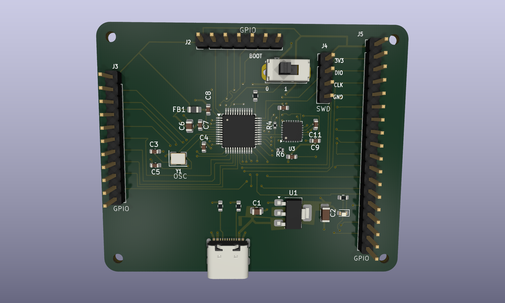
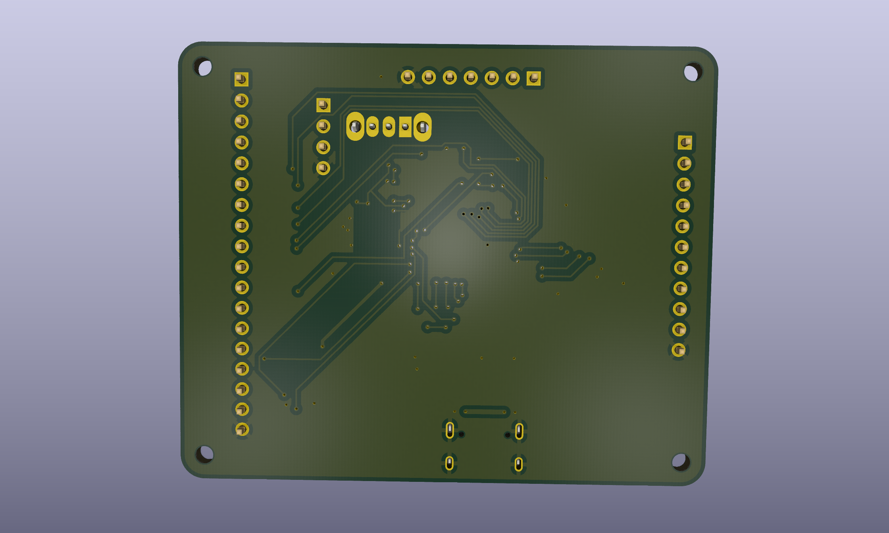

# STM32 Sensor Board

A small custom board built around an **STM32C031C6** microcontroller and an **MPU-6050** 6-axis accelerometer/gyroscope (I2C), designed in KiCad.

**Status:** v1 (2026-09-17), design complete, not yet fabricated or tested.

This is a hardware design project: the repository contains the KiCad schematic and PCB layout only, with no firmware.

| Front | Back |
|---|---|
|  |  |

## Hardware overview

| Ref | Part | Role |
|---|---|---|
| U2 | STM32C031C6Tx (LQFP-48) | Main MCU |
| U3 | MPU-6050 (QFN-24, 4x4 mm) | Accelerometer + gyroscope |
| U1 | AMS1117-3.3 (SOT-223) | 5 V to 3.3 V regulator |
| J1 | USB-C receptacle | 5 V power input (VBUS) |
| Y1 | 16 MHz crystal (3225) with 16 pF load caps (C3, C5) | MCU clock |
| SW1 | SPDT slide switch | BOOT0 select (silkscreen: BOOT 0/1) |
| J4 | 1x4 header | SWD: 3V3, DIO, CLK, GND |
| J2, J3, J5 | 1x7, 1x11, 1x18 headers | GPIO breakout |
| D1 + R3 | LED + 300 ohm | Status LED |
| R4, R6 | 4.7 k | I2C pull-ups |
| FB1 + C6 | 120 ohm ferrite bead + 4.5 uF | Analog supply filtering (+3.3VA) |

Board: 2-layer, about 65.5 x 54 mm, four M2 mounting holes.

## Key connections

| Signal | U2 (MCU) pin | Goes to |
|---|---|---|
| I2C1_SCL | 29 | MPU-6050 SCL (U3 pin 23) |
| I2C1_SDA | 32 | MPU-6050 SDA (U3 pin 24) |
| MPU_INT | 33 | MPU-6050 INT (U3 pin 12) |
| SWCLK / SWDIO | 36 / 35 | J4 |
| NRST | 10 | Reset net |

The remaining MCU pins are broken out to J2, J3 and J5. See the schematic for the full pin mapping.

## Repository layout

```
hardware/   KiCad project (schematic, PCB, project file)
images/     3D renders of the board
```

## Programming and debug interface

The board exposes SWD on header J4 (3V3, DIO, CLK, GND). The USB-C port is used for power only; its data lines are not routed to the MCU.

## Opening the design

Open `hardware/stm32_sensor_board.kicad_pro` in KiCad.


## License

MIT, see [LICENSE](LICENSE).
